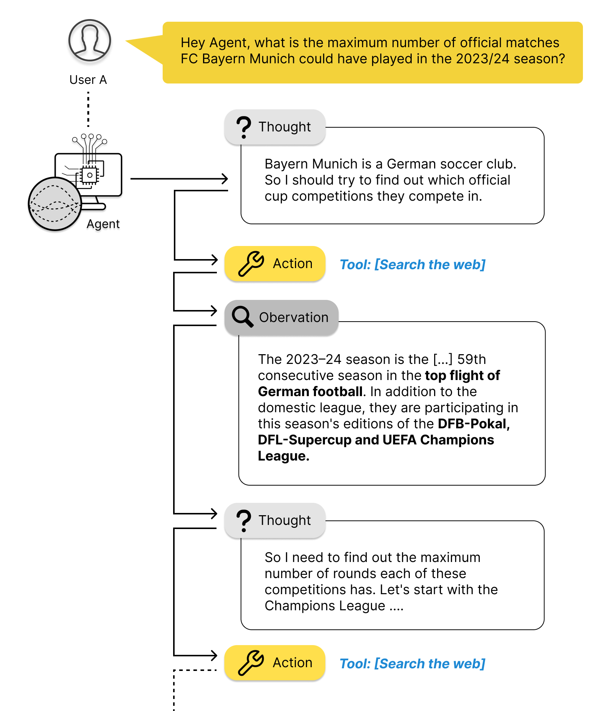

# Tutorial to LangChain SQL Agent

This repo contains code snippets and datasets used in my Medium article "A Beginners Guide to LLM Agents and Toolkits".

## Used Libraries and Tools

* Python: 
  * Sqlite3
  * LangChain
  
## License
[MIT](https://choosealicense.com/licenses/mit/)